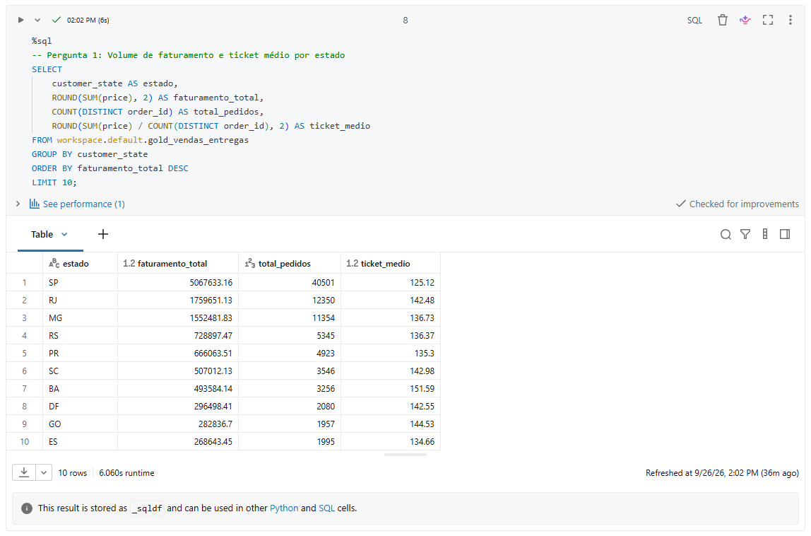
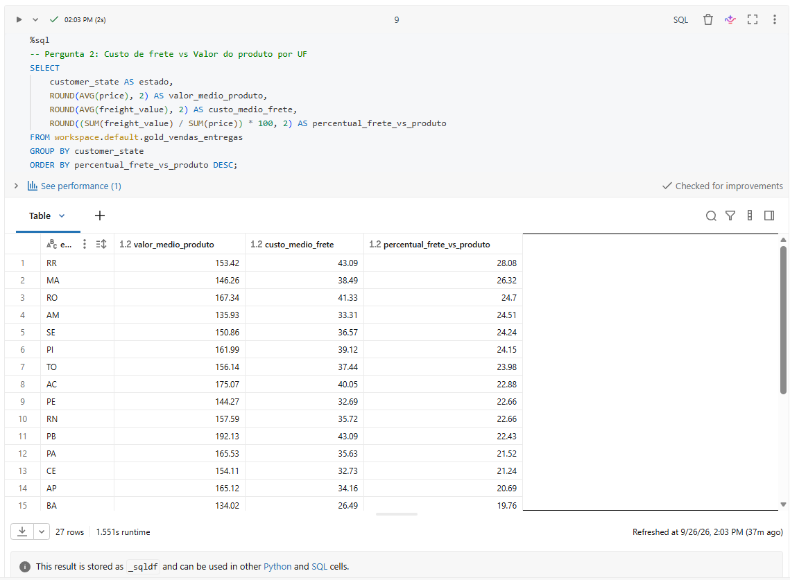
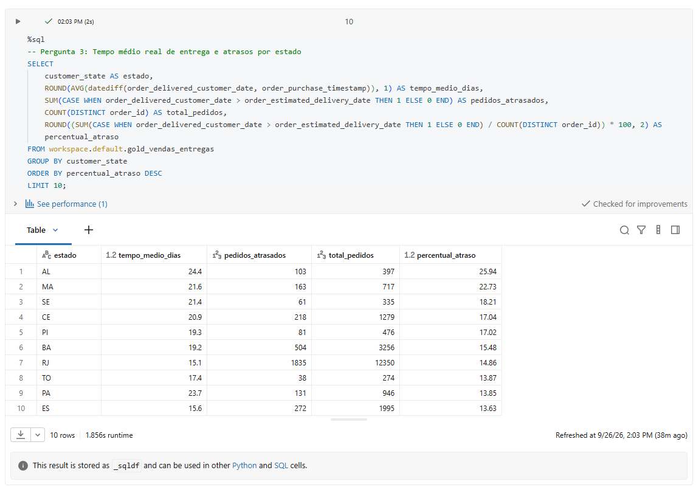
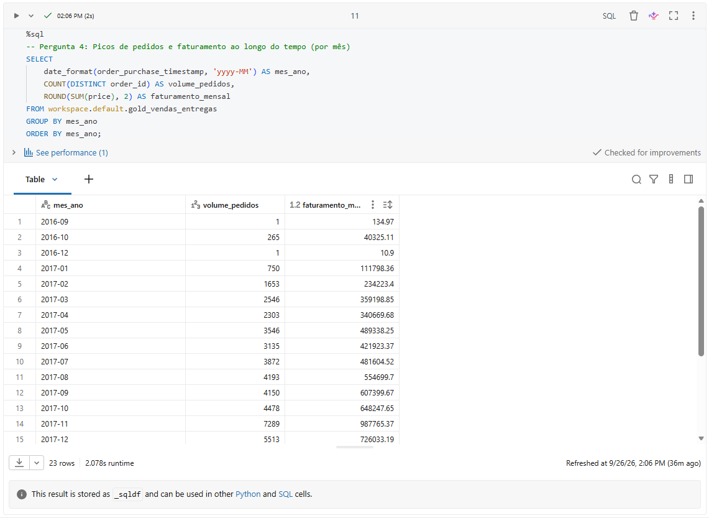
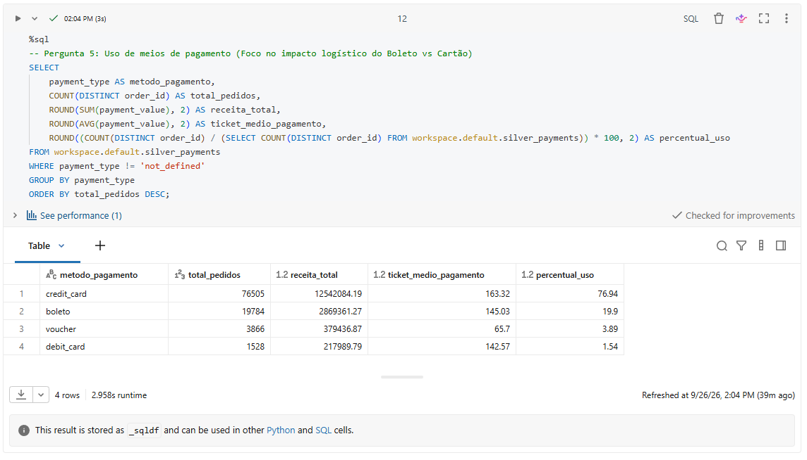

## 1. Contexto de Negócios e Perguntas (Etapa 2 e 4.1)

No comércio eletrônico, a eficiência logística e a diversidade de meios de pagamento são fatores determinantes para a rentabilidade operacional e a satisfação do cliente. A dispersão geográfica do Brasil impõe desafios severos relacionados ao custo de frete e ao cumprimento de prazos de entrega (_SLAs_). Este projeto constrói um pipeline de dados na nuvem, utilizando a arquitetura Lakehouse (padrão Medalhão), para transformar transações brutas de e-commerce em bases analíticas consolidadas.

### Perguntas de Negócio

O pipeline foi modelado para responder aos seguintes questionamentos:

1. Qual é o volume total de faturamento e o ticket médio por estado (UF) do cliente
2. Como o custo de frete se comporta proporcionalmente ao valor dos produtos em diferentes regiões do país?
3. Qual é o tempo médio real de entrega (em dias) por estado e como isso impacta o percentual de atrasos logísticos?
4. Quais são as datas (ano e mês) com maiores picos de volume de pedidos e faturamento?
5. Qual era a dependência do e-commerce brasileiro em relação ao Boleto Bancário e o seu impacto na fricção logística antes da implementação do PIX?

### Estrutura dos Dados Brutos

A base original é composta por tabelas relacionais exportadas em formato CSV:

- `olist_orders_dataset`: Identificação única do pedido, status de processamento e carimbos de tempo (compra, aprovação, envio e entrega ao cliente).
- `olist_order_items_dataset`: Detalhamento financeiro em nível de SKU, contendo preços dos produtos e valores de frete cobrados.
- `olist_customers_dataset`: Identificadores transacionais e globais dos clientes, juntamente com sua localização geográfica (cidade e UF).
- `olist_order_payments_dataset`: Registros da forma de pagamento, parcelamento e valor pago por transação.

### Licença de Uso dos Dados

Os dados são de domínio público, disponibilizados pela Olist através do Kaggle sob a licença **CC BY-NC-SA 4.0** (Attribution-NonCommercial-ShareAlike 4.0 International), permitindo o uso acadêmico, adaptação e compartilhamento do material para fins educacionais e de pesquisa.

## 2. Carga dos Dados (Etapa 4.2)

O processo de Ingestão (Extract & Load) foi executado enviando os arquivos estáticos (CSVs) para o ambiente de nuvem do **Databricks**. Os dados foram armazenados no **Unity Catalog** utilizando o recurso de **Volumes**, que atua como um repositório otimizado para arquivos não estruturados e semiestruturados.

- **Plataforma de Nuvem:** Databricks (Serverless Compute)
- **Caminho de Armazenamento:** `/Volumes/workspace/default/raw_data`
- **Arquivos ingeridos:** `olist_orders_dataset.csv`, `olist_order_items_dataset.csv`, `olist_customers_dataset.csv`, `olist_order_payments_dataset.csv`.

![[unity_catalog.png]]

## 3. Modelagem e Catálogo de Dados (Etapa 4.3)

O projeto adota a **Arquitetura Medalhão** sobre o Delta Lake, progredindo a qualidade do dado nas camadas Bronze, Silver e Gold. O catálogo de dados foi documentado no Unity Catalog, detalhando descrições, tipos e domínios.

### Camada Silver (Tabelas Higienizadas)

Tabela: `silver_orders`

| Coluna                        | Tipo      | Descrição                           | Domínio / Regras                      | Linhagem                         |
| :---------------------------- | :-------- | :---------------------------------- | :------------------------------------ | :------------------------------- |
| order_id                      | String    | Identificador do pedido (PK).       | UUID (sem nulos ou duplicatas).       | olist_orders_dataset.csv         |
| customer_id                   | String    | Chave estrangeira do cliente.       | UUID alfanumérico.                    | olist_orders_dataset.csv         |
| order_status                  | String    | Situação logística do pedido.       | 'delivered', 'shipped', 'canceled'... | olist_orders_dataset.csv         |
| order_purchase_timestamp      | Timestamp | Data e hora exata da compra.        | Formato YYYY-MM-DD HH:MM:SS.          | `olist_orders...` (Cast via ETL) |
| order_delivered_customer_date | Timestamp | Data real de entrega ao cliente.    | Formato YYYY-MM-DD HH:MM:SS.          | `olist_orders...` (Cast via ETL) |
| order_estimated_delivery_date | Timestamp | Promessa original de entrega (SLA). | Formato YYYY-MM-DD HH:MM:SS.          | `olist_orders...` (Cast via ETL) |

Tabela: `silver_order_items`

| Coluna        | Tipo    | Descrição                      | Domínio / Regras            | Linhagem                      |
| :------------ | :------ | :----------------------------- | :-------------------------- | :---------------------------- |
| order_id      | String  | Identificador do pedido (FK).  | UUID alfanumérico.          | olist_order_items_dataset.csv |
| order_item_id | Integer | Sequencial de itens no pedido. | Números inteiros positivos. | olist_order_items_dataset.csv |
| product_id    | String  | Código único do produto (SKU). | UUID alfanumérico.          | olist_order_items_dataset.csv |
| price         | Float   | Preço unitário do produto.     | Valores > 0.                | olist_order_items... (Cast)   |
| freight_value | Float   | Frete rateado do item.         | Valores >= 0.               | olist_order_items... (Cast)   |

Tabela: `silver_customers`

| Coluna         | Tipo   | Descrição                        | Domínio / Regras                | Linhagem                    |
| :------------- | :----- | :------------------------------- | :------------------------------ | :-------------------------- |
| customer_id    | String | Identificador transacional (PK). | UUID (sem nulos ou duplicatas). | olist_customers_dataset.csv |
| customer_city  | String | Município de residência.         | Textos de cidades brasileiras.  | olist_customers_dataset.csv |
| customer_state | String | Sigla da Unidade Federativa.     | 27 siglas padrão IBGE.          | olist_customers_dataset.csv |

Tabela: `silver_payments`

| **Coluna**    | **Tipo** | **Descrição**                   | **Domínio / Regras**                  | **Linhagem**                     |
| ------------- | -------- | ------------------------------- | ------------------------------------- | -------------------------------- |
| order_id      | String   | Identificador do pedido (FK).   | UUID alfanumérico.                    | olist_order_payments_dataset.csv |
| payment_type  | String   | Método de pagamento.            | 'credit_card', 'boleto', 'voucher'... | olist_order_payments_dataset.csv |
| payment_value | Float    | Valor financeiro transacionado. | Valores > 0.                          | olist_order_payments... (Cast)   |

### Camada Gold (Tabela Analítica)

**Tabela: `gold_vendas_entregas`** Tabela consolidada e desnormalizada unindo informações logísticas, geográficas e financeiras. Filtrada via engenharia para refletir apenas os pedidos concluídos (`order_status = 'delivered'`). Facilita o consumo analítico direto sem necessidade de junções complexas pelas ferramentas de Business Intelligence.

![[tabela_gold.png]]

## 4. Pipeline de Dados (Etapa 4.4)

O processo de ETL foi construído e orquestrado em um notebook central na plataforma Databricks, utilizando a API do PySpark para as transformações estruturais e Spark SQL para a modelagem final.

1. **Ingestão (Raw $\rightarrow$ Bronze):** Os arquivos CSV foram lidos como textos puros (`inferSchema = false`) para garantir a captura idêntica à fonte. Colunas de auditoria foram anexadas nativamente (`_ingestion_timestamp` para a data da carga e `_metadata.file_path` para rastreio exato da origem no Unity Catalog).
2. **Limpeza (Bronze $\rightarrow$ Silver):** Aplicação sistemática dos critérios de qualidade (detalhados na seção 5), forçando esquemas corretos com o método `.option("overwriteSchema", "true")` na gravação em Delta.
3. **Modelagem (Silver $\rightarrow$ Gold):** Realizada via blocos `%sql`, agregando a granularidade correta com cláusulas `JOIN` entre Fato e Dimensões.

Todos os dados intermediários e finais foram salvos no formato **Delta**, garantindo transações ACID nativas sobre os objetos.

![[pipeline_de_dados.png]]

## 5. Qualidade de Dados (Etapa 4.5)

A transição da camada Bronze para a Silver foi pautada na aplicação rigorosa dos pilares de Qualidade de Dados, impedindo que falhas brutos chegassem às visões de negócio:

- **Completude:** O método `.dropna(subset=[...])` foi aplicado em colunas-chave críticas (como `order_id` e `customer_id`). Nulos nessas chaves inviabilizam cruzamentos futuros e quebram a integridade referencial.
- **Unicidade:** Múltiplas extrações ou falhas em sistemas de origem geram duplicatas. O método `.dropDuplicates([chaves_primarias])` foi parametrizado nas quatro tabelas Silver para isolar registros únicos (ex: `order_id` na tabela de pedidos).
- **Consistência e Acurácia (Tipagem Estrita):** Os dados brutos importados como `String` foram higienizados. Preços e fretes receberam o `cast("float")` para habilitar funções matemáticas de soma e média. Prazos logísticos sofreram conversão via `to_timestamp()` para possibilitar o cálculo real de intervalo de dias (`datediff`).

## 6. Análise de Dados (Etapa 4.5)

As consultas da camada Gold permitiram a validação das premissas de negócios traçadas na etapa 2.

**Pergunta 1: Faturamento e Ticket Médio por UF**

> _Discussão:_ A análise dos resultados evidencia uma assimetria drástica no e-commerce brasileiro, refletindo diretamente as desigualdades socioeconômicas e de infraestrutura do país no período consolidado da base (2016-2018).

O estado de São Paulo lidera de forma absoluta o volume de mercado, seguido pelo Rio de Janeiro e Minas Gerais. Este cenário é sustentado pela concentração do PIB e pela maior penetração de banda larga domiciliar no Sudeste, aliadas à presença maciça dos principais Centros de Distribuição (CDs) na malha viária paulista, o que reduz o atrito de compra.

O cruzamento do volume absoluto com o ticket médio revela o _insight_ logístico mais valioso desta consulta. Embora São Paulo lidere em faturamento, apresenta o menor ticket médio entre os maiores compradores. Em contrapartida, a Bahia (BA), com um volume de pedidos significativamente menor, detém o maior ticket médio da lista. Esse fenômeno ocorre devido à barreira do custo de frete. Consumidores do Sudeste, beneficiados por fretes mais baratos ou gratuitos, utilizam o e-commerce para compras de conveniência de baixo valor. Já o consumidor do Nordeste enfrenta custos logísticos severos, o que o força a otimizar o seu comportamento de compra: evita a aquisição de itens baratos (cujo frete superaria o valor do produto) e concentra o uso da plataforma em bens de consumo duráveis e de alto valor agregado (como eletrônicos e eletrodomésticos), elevando artificialmente o ticket médio para diluir o impacto financeiro do envio.

**Fontes:**

- **Ebit | Nielsen (2018):** _Relatório Webshoppers (Edição 38)_. Estudo sobre o comportamento do e-commerce brasileiro, ticket médio por região e o impacto logístico nas decisões de compra ([ws38_vfinal.pdf](https://www.fecomercio.com.br/upload/editor/ws38_vfinal.pdf)).
- **CETIC.br (2018):** _Pesquisa TIC Domicílios 2018_. Dados sobre a penetração de acesso à internet, banda larga e desigualdade de infraestrutura digital no Brasil (cetic.br/pt/pesquisa/domicilios).
- **IBGE (2018):** _PNAD Contínua 2018_. Relatório de rendimento de todas as fontes, evidenciando a concentração de massa salarial no Sudeste ([Divulgação anual | IBGE](https://www.ibge.gov.br/estatisticas/sociais/trabalho/17270-pnad-continua.html)).

**Pergunta 2: Custos de Frete vs. Valor do Produto**

> _Discussão:_ A análise da proporção entre o custo do frete e o valor do produto escancara o peso do chamado "Custo Brasil" na cadeia de _Supply Chain_. O topo do ranking é dominado exclusivamente por estados das regiões Norte e Nordeste. Em Roraima (RR) e no Maranhão (MA), o custo de envio chega a representar, respectivamente, 28,08% e 26,32% do valor total da mercadoria adquirida.

Este cenário reflete a extrema concentração dos estoques e Centros de Distribuição (CDs) no eixo Sul-Sudeste no período analisado. Para que um produto saísse de São Paulo e chegasse a Manaus (AM) ou Porto Velho (RO), o mercado dependia de uma infraestrutura rodoviária deficiente para longas distâncias ou do uso de transporte aéreo e fluvial (cabotagem), modais consideravelmente mais caros.

Do ponto de vista de _Business Intelligence_, um frete que consome mais de 1/4 do valor do produto é o principal gatilho para a métrica de "abandono de carrinho". Esses dados corroboram perfeitamente a tese levantada na Pergunta 1: o consumidor do Norte/Nordeste é penalizado geograficamente e viabiliza a compra online apenas quando a indisponibilidade local é absoluta ou quando adquire bens duráveis de ticket muito alto, na tentativa de diluir o impacto percentual de um envio tão oneroso.

**Fontes:**

- **Confederação Nacional do Transporte - CNT (2018):** _Pesquisa CNT de Rodovias 2018_. Relatório detalhando a deficiência da malha rodoviária nas regiões Norte e Nordeste, principal fator de encarecimento do frete e do tempo de trânsito logístico no Brasil ([cnt.org.br](https://data.cnt.org.br/transporte/rodoviario/pesquisa-cnt-de-rodovias-2018/)).
- **Associação Brasileira de Comércio Eletrônico - ABComm (2018):** _Levantamento de Custos Logísticos no E-commerce_. Estudo de mercado apontando o custo do frete como o responsável por mais de 70% dos casos de abandono de carrinho no varejo digital brasileiro ([abcomm.org](https://abiacom.org/estudos/)).
- **Fundação Dom Cabral - FDC (2018):** _Custos Logísticos no Brasil_. Pesquisa macroeconômica evidenciando como a dependência do modal rodoviário e a grande distância dos centros produtores elevam exponencialmente o repasse de custos de transporte para o consumidor final em regiões afastadas ([fdc.org.br](https://nucleos.fdc.org.br/fdc-nucleo-logistica/#publicacoes)).

**Pergunta 3: Tempo Médio de Entrega e Atrasos Logísticos**

> _Discussão:_ A análise ao tempo de trânsito logístico expõe de forma crua as assimetrias de infraestrutura e os desafios de segurança pública no Brasil. O topo da tabela de atrasos é dominado por estados da região Nordeste, com Alagoas (AL) a registar uma taxa de quebra de SLA alarmante: mais de 1 em cada 4 pedidos (25,94%) não chegou dentro do prazo estimado, com uma média de espera de 24,4 dias. O Maranhão (MA) e Sergipe (SE) seguem a mesma tendência, o que evidencia a profunda dependência de malhas rodoviárias longas e a falta de centros de distribuição avançados nestas regiões durante o período analisado.

Um dado que se destaca nesta consulta é a presença do Rio de Janeiro (RJ) na 7.ª posição, com 14,86% de atrasos e uma média de 15,1 dias para a entrega, números invulgares para o eixo do Sudeste. Este fenómeno não é justificado pela distância, mas sim pela crise de segurança pública que atingiu o estado entre 2017 e 2018. O agravamento do roubo de cargas forçou as transportadoras e a empresa pública de Correios a mapearem centenas de "Áreas com Restrição de Entrega". Nestes locais, as encomendas sofriam atrasos severos devido à necessidade de agrupamento de carga para escolta armada ou obrigavam o cliente a deslocar-se a uma agência para o levantamento físico do produto.

Em termos de _Business Intelligence_, uma taxa de quebra de promessa de entrega superior a 15% (verificada nos seis primeiros estados da lista) é um fator crítico de insatisfação. Este cenário gera não só o aumento dos custos operacionais com o apoio ao cliente (SAC) e logística reversa, mas também destrói a métrica de retenção e recompra nas regiões afetadas.

**Fontes:**

- **Federação das Indústrias do Estado do Rio de Janeiro - FIRJAN (2018):** _Relatório de Roubo de Cargas no Estado do Rio de Janeiro_. Estudo detalhado sobre o impacto da crise de segurança na cadeia de abastecimento, que levou à criação de zonas de restrição de entrega e ao colapso dos prazos logísticos no estado. (https://firjan.com.br/lumis/portal/file/fileDownload.jsp?fileId=2C908A8A6895B4030168A94F999652F5)
- **Confederação Nacional do Transporte - CNT (2018):** _Boletim Estatístico da CNT_. Dados sobre a ineficiência e degradação da malha rodoviária nas vias de ligação ao Norte e Nordeste, justificando os elevados tempos médios de trânsito no comércio eletrónico. (https://data.cnt.org.br/sociedade/boletim-estatistico-2018-jan-2018-2/)
- **Associação Brasileira de Comércio Eletrónico - ABComm (2018):** _Impacto da Logística na Experiência do Consumidor_. Relatório de mercado que quantifica a quebra de SLA (atrasos na entrega) como o principal promotor de avaliações negativas e perda de _Lifetime Value_ (LTV) no varejo digital. (https://abiacom.org/estudos/)

**Pergunta 4: Picos Sazonais e Faturamento (Agrupamento Temporal)**

> _Discussão:_ A visualização da série histórica completa permite compreender não apenas o fenômeno sazonal clássico, mas também a curva de consolidação do _e-commerce_. O pico absoluto ocorre, de fato, em novembro de 2017, com um salto abrupto para 7.289 pedidos e quase R$ 1 milhão de faturamento (um crescimento de 62,7% face ao mês anterior). Isto confirma o impacto avassalador da Black Friday, que sujeitou a malha logística e os sistemas a um teste de _stress_ severo.

No entanto, a análise dos dados de 2018 revela o _insight_ de negócio definitivo: o efeito "rampa" pós-Black Friday. Longe de ser um evento isolado, novembro serviu como acelerador de aquisição e retenção de clientes. Ao compararmos o primeiro trimestre de 2017 (4.949 pedidos) com o primeiro trimestre de 2018 (20.627 pedidos), constata-se um crescimento homólogo de **316%**. Ao longo de 2018, a plataforma não regressou aos níveis anteriores, estabilizando num novo patamar de maturidade com médias mensais acima de 6 mil transações. Do ponto de vista de Engenharia de Dados, esta mudança de volume de tráfego de forma definitiva justifica plenamente o abandono de arquiteturas tradicionais em favor de um modelo _Lakehouse_ elástico (_Serverless_), capaz de garantir _performance_ e escalabilidade contínuas sem gargalos operacionais.

**Fontes:**

- **Ebit | Nielsen (2018):** _Relatório Webshoppers (Edição 37 e 38)_. Estudo consolidado sobre o mercado brasileiro que demonstra como a Black Friday atua não apenas como um pico de vendas, mas como o principal motor de experimentação e retenção de novos consumidores (e-shoppers) para o ano letivo seguinte. (https://www.fecomercio.com.br/upload/editor/pdfs/ws37_imprensa.pdf)
- **Associação Brasileira de Comércio Eletrónico - ABComm (2018):** _Crescimento do E-commerce no Brasil_. Dados macroeconómicos sobre a estabilização e o aumento sustentado do volume de compras recorrentes no início de 2018, validando a maturidade digital do retalho. (https://dados.abcomm.org/crescimento-do-ecommerce-brasileiro)

**Pergunta 5: A dependência do Boleto Bancário e a fricção logística**

> _Discussão:_ A análise da base histórica demonstra que, embora o cartão de crédito respondesse pela grande maioria do mercado (76,94%), o Boleto Bancário sustentava praticamente 1 em cada 5 pedidos (19,9%). No ecossistema de _Supply Chain_, um volume de quase 20% condicionado a um meio de pagamento com liquidação morosa (que exige de 1 a 3 dias úteis para compensação bancária) representa um gargalo operacional grave. Durante esse período de "reserva", o estoque do lojista fica bloqueado — indisponível para outros compradores reais — e o _time-to-dispatch_ (tempo até a postagem) é congelado, estendendo artificialmente o prazo de entrega final (SLA) percebido pelo cliente.

Esta fotografia da base ilustra perfeitamente o atrito logístico e financeiro superado estruturalmente no Brasil a partir de novembro de 2020. A implementação do PIX pelo Banco Central atacou cirurgicamente a deficiência tecnológica do boleto, garantindo compensação instantânea (o que libera o fluxo de postagem no mesmo dia) e incluindo digitalmente a vasta parcela da população desbancarizada ou sem limite de crédito. O pipeline de dados revela, portanto, o tamanho exato da dor que o PIX veio curar no varejo digital.

**Fontes:**

- **Banco Central do Brasil - BCB (2020):** _Lançamento do Pix e a Digitalização do Sistema Financeiro_. Relatórios e normativas do BCB sobre a modernização dos pagamentos instantâneos para mitigar a ineficiência de liquidação de boletos e a fricção no varejo ([Sobre o Pix](https://www.bcb.gov.br/estabilidadefinanceira/pix-sobre)).
- **Ebit | Nielsen (2018/2019):** _Relatório Webshoppers (Edição 38)_. Aponta a forte adesão do boleto bancário no período analisado como alternativa principal para consumidores desbancarizados ou avessos ao comprometimento do limite do cartão de crédito no e-commerce. ([ws38_vfinal.pdf](https://www.fecomercio.com.br/upload/editor/ws38_vfinal.pdf))

## 7. Autoavaliação

O desenvolvimento deste MVP atendeu com sucesso ao desafio de elaborar um ciclo integral de Engenharia de Dados em nuvem, superando o simples agrupamento de tabelas para aplicar conceitos arquiteturais profundos de governança.

A estrutura desenhada valida o aprendizado das disciplinas do programa da pós-graduação da PUC e aproxima o projeto de arquiteturas utilizadas por equipes sêniores na indústria corporativa privada. O desenvolvimento nativo no ecossistema Databricks Serverless exigiu fluidez e adaptação contínua às melhores práticas, incluindo a assimilação de modernizações do próprio Unity Catalog (como a depreciação de certas _functions_ de origem).

As premissas iniciais foram integralmente atendidas. Como trabalhos de expansão para enriquecimento de portfólio, projeta-se a evolução deste script único para uma arquitetura orquestrada (via Databricks Workflows) e a integração autônoma dos arquivos fonte através de APIs de _Data Ingestion_, reduzindo o esforço do processo ELT de _batch_ manual para operação automatizada recorrente.